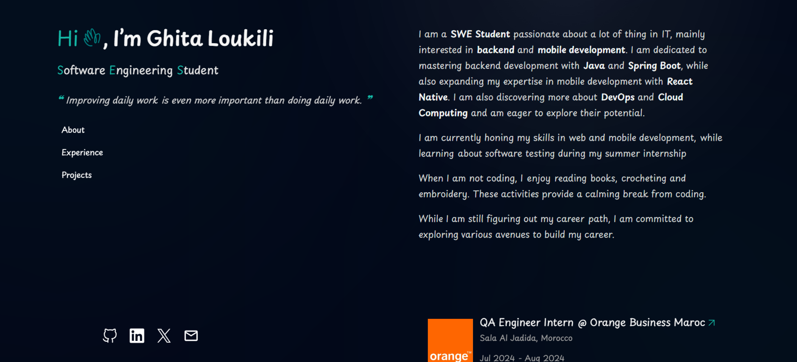

# Rita's Portfolio (V1)

Hey there, this is my personal portfolio website built with Astro. It's a simple and clean website that showcases my experience, projects and skills. This portfolio is inspired from [Gorka](https://gorka.iand.dev) while the design is based on [Brittany Chiang Portfolio](https://brittanychiang.com).


# ⚙️ Stack used
- ☄️ Astro
- 🍃 Tailwind CSS
- ⚔️ TypeScript

<p aligh="center">
    
</p>

# 🛠️ Installation & Set Up

Here's how you can get started on the project :

1. Clone the repository
```bash
git clone https://github.com/RitaSensei/Rita-Portfolio
```

2. Navigate to the project directory
```bash
cd rita-portfolio
```

3. Install the dependencies
```bash
npm install
```

4. Start the development server
```bash
npm run dev
```

# 📢Deploy on Vercel

You can deploy your Astro site using [Vercel](https://vercel.com) by following this guide : [Deploy your Astro Site to Vercel](https://docs.astro.build/en/guides/deploy/vercel/)

# 🤝 Connect With Me
You can reach out to me on :
- LinkedIn : [Ghita Loukili](https://www.linkedin.com/in/ghita-loukili-46405924a/)
- X : [Rita](https://x.com/GhitaSensei)
- Email : [ghitaloukili@gmail.com](mailto:ghitaloukili@gmail.com)

# 💡 Learn More

Feel free to check [our documentation](https://docs.astro.build) to learn more about Astro, you can also the check the [Astro Github repository](https://github.com/withastro/astro).
